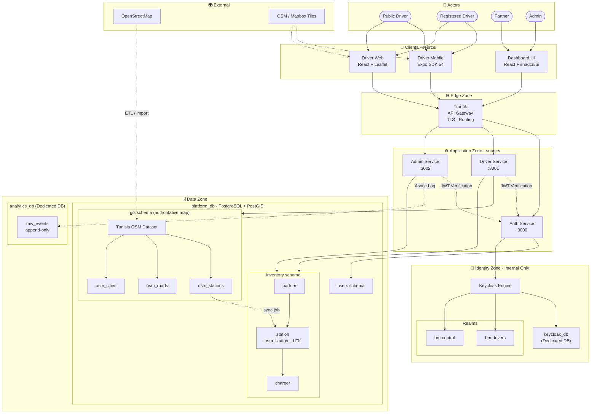

# BorneMap System Architecture

## 🏗️ System Overview



---

## 🎯 Zone Architecture

### 1. **👤 Actors Zone**
The personas that interact with the BorneMap ecosystem:

| Actor | Persona | Primary Interaction |
|-------|---------|---------------------|
| **Public Driver** | Unregistered user | Map discovery, station location |
| **Registered Driver** | Authenticated user | Station details, charger status |
| **Partner** | Charging network operator | Asset management, deployment |
| **Admin** | System administrator | System configuration, analytics |

---

### 2. **🌐 Edge Zone**
**Traefik API Gateway** - The single entry point for all traffic

**Responsibilities**:
- TLS termination (HTTPS)
- Request routing to backend services
- Rate limiting & DDoS protection
- Request logging & monitoring

**Routing Rules**:
```
/api/v1/auth/*     → Auth Service (:3000)
/api/v1/driver/*   → Driver Service (:3001)
/api/v1/admin/*    → Admin Service (:3002)
```

---

### 3. **📱 Clients Zone**
Three client applications accessing the BorneMap platform:

#### **Driver Mobile** (Expo SDK 54)
- **Technology**: React Native + Expo
- **Target Users**: Public & Registered Drivers
- **Key Features**:
  - Real-time proximity search (5km radius)
  - Station details & charger availability
  - Navigation integration
  - Haptic feedback on station selection
- **Local Data**: `@bornemap/shared-mobile` TypeScript contracts
- **Map Source**: OSM/Mapbox tiles (client-side rendering)

#### **Driver Web** (React + Leaflet)
- **Technology**: React + Leaflet.js
- **Target Users**: Public & Registered Drivers (desktop)
- **Key Features**:
  - Station discovery in Tunisia
  - Route planning integration
  - Advanced filtering (charger type, power)
  - Responsive design
- **Map Source**: OSM/Mapbox tiles (Leaflet renderer)

#### **Dashboard UI** (React + shadcn/ui)
- **Technology**: React + shadcn/ui component library
- **Target Users**: Partners & Admins
- **Key Features**:
  - Partner asset management
  - Station lifecycle management
  - Charger deployment & monitoring
  - Real-time analytics
  - User permission management

---

### 4. **⚙️ Application Zone**

#### **Auth Service** (:3000)
**Purpose**: Centralized identity and access management

**Responsibilities**:
- User registration & login
- JWT token generation & validation
- OAuth2/OIDC integration via Keycloak
- Permission/scope management
- Session lifecycle

**Key Endpoints**:
```
POST   /api/v1/auth/register      Create new user account
POST   /api/v1/auth/login         Authenticate & receive JWT
POST   /api/v1/auth/refresh       Refresh expired token
POST   /api/v1/auth/logout        Revoke session
GET    /api/v1/auth/verify        Validate JWT token
GET    /api/v1/auth/profile       Get authenticated user info
```

**Integration**:
- Validates credentials against `users` schema
- Creates session in Keycloak (`bm-drivers` or `bm-control` realm)
- Issues signed JWT tokens for downstream services
- Manages refresh token rotation

#### **Driver Service** (:3001)
**Purpose**: Read-optimized geospatial proximity lookups

**Current Endpoints**:
```
GET    /api/v1/driver/nearby      Proximity search (lon, lat, radius)
GET    /api/v1/driver/health      Service health check
GET    /docs/swagger              OpenAPI documentation
```

**Future Endpoints**:
```
GET    /api/v1/driver/station/{id}    Station details + chargers
GET    /api/v1/driver/charger/{id}    Charger specifications
GET    /api/v1/driver/favorites       User bookmarked stations
POST   /api/v1/driver/favorites/{id}  Add station to favorites
```

**Data Access**:
- Read from `gis.*` schema (authoritative map view)
- Read from `inventory.*` schema (station metadata)
- Validates requests via JWT from Auth Service
- Caches results for 60 seconds

#### **Admin Service** (:3002)
**Purpose**: Write operations and asset management

**Current Endpoints**:
```
POST   /api/v1/admin/partners              Create partner
GET    /api/v1/admin/partners/{id}        Retrieve partner
POST   /api/v1/admin/stations             Create station
PATCH  /api/v1/admin/stations/{id}/live   Publish/unpublish
POST   /api/v1/admin/chargers             Add charger
GET    /api/v1/admin/health               Service health check
GET    /docs/swagger                      OpenAPI documentation
```

**Future Endpoints**:
```
PUT    /api/v1/admin/stations/{id}        Update station details
DELETE /api/v1/admin/stations/{id}        Decommission station
PATCH  /api/v1/admin/chargers/{id}        Update charger status
GET    /api/v1/admin/analytics            Usage analytics
```

**Data Access**:
- Write to `inventory.*` schema
- Triggers automatic `gis.*` cache synchronization
- Logs operations to `analytics_db` (async)
- Validates requests via JWT from Auth Service
- Enforces role-based access control (RBAC)

---

### 5. **🗄️ Data Zone**

#### **platform_db** - PostgreSQL + PostGIS (Authoritative)

**Schema: `gis`** (Geospatial Cache - Read-Optimized)
```sql
-- Spatial coverage of entire Tunisia region
osm_stations     -- EV charging stations (GIST indexed)
osm_roads        -- Road network for routing
osm_cities       -- Municipality boundaries

Index: GIST on osm_stations.coordinates
Function: gis.get_nearby_stations(lon, lat, radius_m)
```

**Schema: `inventory`** (Relational Core - Business Logic)
```sql
partner          -- Charging network operators
station          -- Physical charging locations
  └─ osm_station_id FK → gis.osm_stations
charger          -- Individual hardware plugs
  └─ plug_type_code FK → configuration.plug_types
configuration    -- Reference data (plug types, etc.)
```

**Schema: `users`** (Identity - Read by Auth Service)
```sql
user             -- User accounts
user_role        -- Role assignments
user_permission  -- Fine-grained permissions
```

**Cross-Schema Synchronization**:
- Trigger: `gis.sync_inventory_station_to_gis_cache()`
- When station is created or updated, automatically upserts to `gis.osm_stations`
- Ensures map view always reflects authoritative inventory
- Latency: < 100ms for trigger execution

#### **analytics_db** - PostgreSQL (Dedicated Analytics)

**Purpose**: Append-only event log for analytics and audit

**Schema**:
```sql
raw_events
├─ event_type    (discovery, selection, favorite, error)
├─ user_id       (anonymized UUID)
├─ timestamp     (UTC timezone)
├─ metadata      (JSON - contains context)
└─ session_id    (correlation ID)
```

**Data Flow**:
- Driver Service logs `discovery` events (async, fire-and-forget)
- Admin Service logs `asset_operation` events (async)
- Auth Service logs `authentication` events (async)
- Retention: 12 months rolling window
- Used for business intelligence & trend analysis

---

### 6. **🔐 Identity Zone** (Internal Only)

#### **Keycloak Engine**
**Purpose**: OAuth2/OIDC identity provider (not directly accessed by clients)

**Realms**:
- **`bm-drivers`** - Driver account realm
  - Public registration enabled
  - Email verification required
  - Auto-provisioning from OAuth providers (Google, Apple)
  
- **`bm-control`** - Control plane realm
  - Admin & Partner accounts only
  - Manual provisioning via dashboard
  - MFA enforced

**Integration with Auth Service**:
1. Auth Service acts as confidential OAuth2 client
2. Users authenticate via Auth Service (not directly to Keycloak)
3. Auth Service validates credentials and issues internal JWTs
4. JWTs signed with RS256 key (public key available to other services)
5. Keycloak database isolated in dedicated container

#### **keycloak_db** - PostgreSQL (Dedicated Identity Store)
- Isolated from `platform_db` (zero data crossover)
- Stores user sessions, permissions, token history
- Retention: Session-based (30-day inactivity cleanup)

---

### 7. **🌍 External Zone**

#### **OpenStreetMap (OSM)**
**Purpose**: Authoritative source of geospatial data

**Data Flow**:
1. **Initial Import**: `source/scripts/import-tunisia-osm.sh`
   - Queries Overpass API for charging station nodes
   - Extracts tags: amenity=charging_station, name, operator
   - Bulk inserts into `gis.osm_stations`
   
2. **Ongoing Updates**: Scheduled ETL job (weekly)
   - Pulls delta updates from OSM (changeset API)
   - Merges with existing records
   - Maintains historical state for auditing

#### **Map Tiles (OSM / Mapbox)**
**Purpose**: Client-side map rendering

**Usage**:
- Mobile app: Uses cached OSM tiles (offline-first approach)
- Web app: Uses Mapbox GL JS with mapbox-gl-core tiles
- Dashboard: Background map via Leaflet Static layer

**Tile Sources**:
```
OSM: https://tile.openstreetmap.org/{z}/{x}/{y}.png
Mapbox: https://api.mapbox.com/v4/...
```

---

## 📊 Data Flow Patterns

### Pattern 1: Driver Discovery Flow
```
User Location (lat, lon)
    ↓
Mobile App validates coordinates (geo-core boundary check)
    ↓
HTTP GET /api/v1/driver/nearby?lon=X&lat=Y
    ↓
Traefik routes to Driver Service :3001
    ↓
Auth Service validates JWT token
    ↓
Driver Service executes:
  SELECT * FROM gis.get_nearby_stations($1, $2, $3)
    ↓
PostGIS calculates distances (GIST index acceleration)
    ↓
Aggregates charger details (JSONB)
    ↓
Returns {stations: [...], count: N}
    ↓
Async log to analytics_db (fire-and-forget)
    ↓
Client renders map with marker pins
```

### Pattern 2: Partner Asset Creation Flow
```
Partner Dashboard: Create Station
    ↓
React form captures: name, address, lat, lon
    ↓
HTTP POST /api/v1/admin/stations
    ↓
Traefik routes to Admin Service :3002
    ↓
Auth Service validates JWT (requires PARTNER role)
    ↓
Admin Service validates:
  - Partner exists (FK)
  - Coordinates within Tunisia bounds (geo-core)
    ↓
Inserts into inventory.stations
    ↓
Database trigger fires:
  gis.sync_inventory_station_to_gis_cache()
    ↓
INSERT INTO gis.osm_stations
  (coordinates, is_available, source='PLATFORM_SYNC')
    ↓
Async log to analytics_db
    ↓
Return {data: station_dto, message: "..."}
    ↓
Now visible to drivers in proximity search
```

### Pattern 3: Authentication Flow
```
User enters credentials (email, password)
    ↓
Mobile/Web sends POST /api/v1/auth/login
    ↓
Traefik routes to Auth Service :3000
    ↓
Auth Service:
  1. Validates credentials vs users schema
  2. Creates session in Keycloak (bm-drivers realm)
  3. Generates JWT token (RS256 signed)
  4. Stores refresh token in secure httpOnly cookie
    ↓
Returns {access_token, expires_in}
    ↓
Client stores JWT in memory
    ↓
Subsequent requests include:
  Authorization: Bearer <JWT>
    ↓
Downstream services verify JWT signature
  (using public key from Auth Service)
    ↓
Extract user_id, roles, permissions from JWT claims
```

---

## 🔒 Security Architecture

### Network Isolation
```
┌─────────────────────────┐
│    Public Internet       │
│    (Port 80/443)        │
└────────────┬────────────┘
             │
         Traefik
       (TLS Termination)
             │
    ┌────────┴────────┐
    │                 │
  Auth Service   Driver Service   Admin Service
    │                 │                 │
    └────────────┬────────────────────┘
                 │
        platform_mesh Network
       (Internal Docker Network)
                 │
    ┌────────────┼────────────┐
    │            │            │
 platform_db  analytics_db  keycloak_db
 (PostgreSQL) (PostgreSQL)   (PostgreSQL)
```

**Key Properties**:
- All backend services run inside isolated `platform_mesh` network
- No direct internet access from services
- Database ports (:5432) not exposed to host
- Only Traefik exposes ports (:80, :443)
- Secrets injected via environment variables
- No hardcoded credentials in code

### Authentication & Authorization

**JWT Token Structure**:
```json
{
  "sub": "user-12345",
  "email": "driver@example.com",
  "roles": ["driver", "premium"],
  "scopes": ["station:read", "favorite:write"],
  "iat": 1686758400,
  "exp": 1686762000,
  "iss": "https://auth.bornemap.tn"
}
```

**Role-Based Access Control (RBAC)**:
```
Roles:
├─ driver         (public driver)
├─ driver:premium (subscription-based)
├─ partner        (charging network)
└─ admin          (system administrator)

Scopes:
├─ station:read    (view stations)
├─ station:write   (create/update)
├─ charger:read    (view chargers)
├─ charger:write   (manage chargers)
├─ favorite:write  (bookmark stations)
├─ analytics:read  (view usage data)
└─ admin:full      (all permissions)
```

**Enforcement**:
- Auth Service issues role-aware JWTs
- Each endpoint validates required scopes
- Admin Service enforces stricter RBAC
- Keycloak realms separate driver from control plane access

---

## 📈 Performance Characteristics

### Proximity Query
```
Operation: GET /api/v1/driver/nearby?lon=10.1815&lat=36.8065&radius=5000

Index Used:        GIST spatial index on gis.osm_stations.coordinates
Database:          PostgreSQL native geodetic distance calculation
Aggregation:       Server-side JSONB construction
Typical Latency:   < 100ms (p95)
Cache Strategy:    Client-side (60s debounce on mobile)
Scaling:           Vertical (connection pool tuning)
```

### Admin Write Operations
```
Operation: POST /api/v1/admin/stations

Validation:        Geospatial bounds check (CPU-bound)
Database Latency:  INSERT + trigger execution < 50ms
Async Logging:     fire-and-forget to analytics_db
Cross-Schema Sync: automatic via trigger (< 10ms)
Typical End-to-End: < 200ms
Scaling:           Horizontal (add more admin service instances)
```

### Authentication
```
Operation: POST /api/v1/auth/login

Credential Lookup:  B-tree index on users.email < 5ms
Password Hashing:   bcrypt (intentionally slow) ~300ms
JWT Generation:     RS256 signing < 2ms
Keycloak Session:   Create in keycloak_db < 20ms
Total Latency:      ~300ms
Cache Strategy:     JWT refresh token rotation
```

---

## 🚀 Deployment Architecture

### Container Composition (Development)
```yaml
services:
  traefik:           # Load balancer & reverse proxy
  driver-service:    # :3001 (read-optimized)
  admin-service:     # :3002 (write-optimized)
  auth-service:      # :3000 (identity)
  platform_db:       # PostgreSQL + PostGIS
  analytics_db:      # PostgreSQL (isolated)
  keycloak:          # OAuth2/OIDC provider
  keycloak_db:       # Keycloak identity store
```

### Production Deployment (Kubernetes)
```
Namespace: bornemap-system
├─ Deployments:
│  ├─ auth-service (replicas: 3)
│  ├─ driver-service (replicas: 5, HPA enabled)
│  └─ admin-service (replicas: 2, HPA enabled)
├─ StatefulSets:
│  ├─ platform_db (1 replica, persistent volume)
│  ├─ analytics_db (1 replica, persistent volume)
│  └─ keycloak_db (1 replica, persistent volume)
├─ ConfigMaps:
│  └─ service configurations
├─ Secrets:
│  └─ database credentials, JWT keys
└─ Services:
   └─ ClusterIP for internal communication
```

---

## 📋 Configuration Matrix

| Component | Environment Variable | Default | Purpose |
|-----------|---------------------|---------|---------|
| Auth Service | `AUTH_JWT_SECRET` | (required) | RS256 signing key |
| Auth Service | `KEYCLOAK_URL` | `http://keycloak:8080` | Internal Keycloak endpoint |
| Driver Service | `DATABASE_URL` | `postgres://...` | Connection string |
| Driver Service | `CACHE_TTL` | `60` | Proximity query cache (seconds) |
| Admin Service | `DATABASE_URL` | `postgres://...` | Connection string |
| Admin Service | `ANALYTICS_URL` | `postgres://...` | Analytics DB connection |
| All Services | `RUST_LOG` | `info` | Logging level |

---

## 🔄 Synchronization & Consistency

### Spatial Cache Synchronization
```
Event: Station created in inventory.stations
  ↓
Trigger: gis.sync_inventory_station_to_gis_cache()
  ↓
Action: UPSERT into gis.osm_stations
  ↓
Consistency: Immediate (< 10ms)
Guarantees: Strong consistency (serializable isolation level)
```

### Analytical Event Logging
```
Event: Discovery query, asset creation, auth action
  ↓
Service: Sends async log message (non-blocking)
  ↓
Queue: In-memory queue (rabbitMQ future)
  ↓
Consumer: Writes to analytics_db (eventual consistency)
  ↓
Latency: seconds to minutes
Guarantees: At-least-once delivery
Retention: 12 months rolling window
```

### OSM Data Updates
```
Frequency: Weekly scheduled job
Mechanism: Overpass API changeset polling
Merge Strategy: Last-write-wins
Rollback: Point-in-time recovery via pgBackRest
```

---

## 🎯 Future Enhancements

### Phase 2: Real-Time Features
- WebSocket support for live charger status
- Server-sent events (SSE) for station availability
- Push notifications on driver matches

### Phase 3: Advanced Analytics
- Machine learning for demand forecasting
- Pricing optimization per location
- Driver behavior clustering

### Phase 4: Multi-Region
- Geographic replication (Tunisia → Morocco, Egypt)
- Cross-border journey planning
- Regional data sovereignty compliance

---

## 📖 References

- Architecture Decision Records: `/docs/adr/`
- Implementation Details: `IMPLEMENTATION_SUMMARY.md`
- Quick Start Guide: `QUICKSTART.md`
- API Documentation: `http://localhost/docs/swagger`

---

**Last Updated**: June 14, 2026  
**Status**: MVP-1 (70% Complete)  
**Next Review**: End of Sprint
