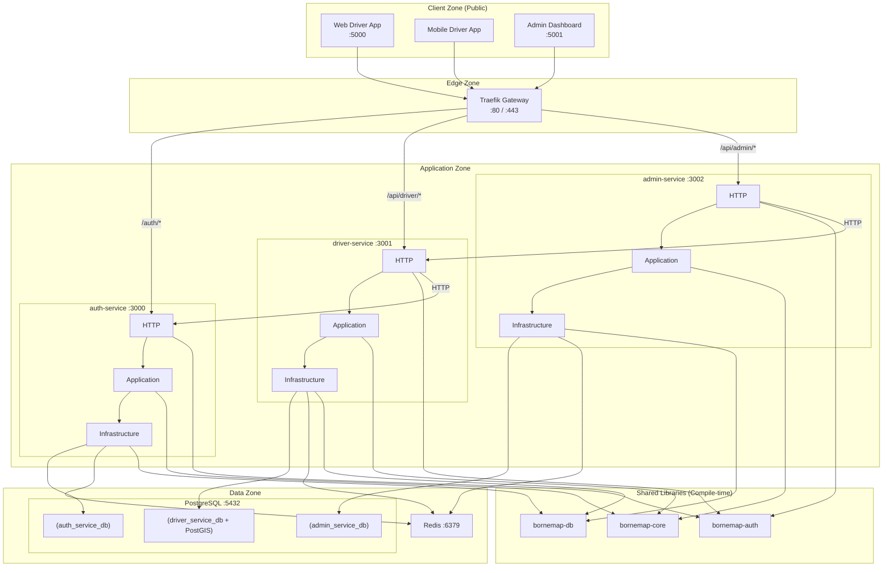

# BorneMap Architecture

## Overview

BorneMap is an EV charging discovery platform for Tunisia. It follows a microservices architecture with a Traefik gateway, three backend services, two frontend apps, and a strict layered architecture per service.

---

## System Diagram



---

## Port Strategy

| Component | Port | Status |
|---|---|---|---|
| Traefik | 80 / 443 | Planned |
| auth-service | 3000 | Implemented |
| driver-service | 3001 | Planned |
| admin-service | 3002 | Planned |
| Web driver app | 5000 | Planned |
| Admin dashboard | 5173 (dev) / 5001 (prod) | Implemented |
| PostgreSQL | 5432 | Required |
| Redis | 6379 | Required |

---

## Zones

### Z0 — Client Zone (Public)

| Client | Technology | Port | Status |
|---|---|---|---|
| Web Driver App | React 19 + Vite 8 + Tailwind v4 | 5000 | Planned |
| Mobile Driver App | React Native (Expo) | — | Planned |
| Admin Dashboard | React 19 + Vite 8 + Tailwind v4 | 5173 (dev) / 5001 (prod) | Implemented |

All client traffic routes through Traefik gateway. No direct service access.

**Implemented clients:**
- **Admin Dashboard** (`apps/admin-dashboard/`) — React 19 SPA with Tailwind v4 terminal-green theme, React Router, TanStack Query, Zustand, Axios, Framer Motion, Recharts. See `docs/sprints/sprint_09.md`.

### Z1 — Edge Zone

**Traefik v3** acts as the single entry point. Routes:

| Path Prefix | Target Service |
|---|---|
| `/auth/*` | auth-service (:3000) |
| `/api/driver/*` | driver-service (:3001) |
| `/api/admin/*` | admin-service (:3002) |

### Z2 — Application Zone

Each service follows the **layered architecture** mandated by SDEC:

```
HTTP Layer (DTOs + handlers)
    ↓
Application Layer (orchestration + transactions)
    ↓
Infrastructure Layer (SQLx, Redis, external systems)
    ↓
Domain Layer (pure Rust, no IO)
```

#### auth-service (:3000)

JWT issuer. Manages authentication, refresh tokens, role assignment.

- **Domain**: User, Session, Role, JwtToken types
- **Application**: RegisterUseCase, LoginUseCase, RefreshUseCase, LogoutUseCase
- **Infrastructure**: PgUserRepository, PgSessionRepository, JwtProvider, Argon2Hasher
- **HTTP**: Auth handlers, DTOs

#### driver-service (:3001)

Core EV charging logic: station discovery, charging sessions, geospatial queries.

- **Domain**: Station, Charger, ConnectorType, ChargingSession, Review, Driver types
- **Application**: StationSearchUseCase, StartSessionUseCase, StopSessionUseCase, NearbyQueryUseCase
- **Infrastructure**: PgStationRepository (PostGIS), PgBookingRepository, RedisCache
- **HTTP**: Driver API handlers, DTOs

#### admin-service (:3002)

Admin operations: manage stations, partners, drivers, analytics.

- **Domain**: Admin, Partner, StationStatus, AuditLog types
- **Application**: ManageStationsUseCase, ManagePartnersUseCase, AnalyticsUseCase
- **Infrastructure**: PgAdminRepository, PgAuditRepository
- **HTTP**: Admin API handlers, DTOs

### Z3 — Shared Libraries (Compile-time, not services)

| Crate | Responsibility | Used By |
|---|---|---|
| `bornemap-core` | Domain types, errors, enums across all services | All services (app layer) |
| `bornemap-db` | DB helpers, connection pooling, migration utilities | All services (infra layer) |
| `bornemap-auth` | JWT validation, role checking, request guards | All services (http layer) |

Key rules:
- Shared crates are compile-time dependencies only
- No shared database across services
- `bornemap-auth` does JWT **validation only** (issuance is auth-service only)

### Z4 — Data Zone

#### PostgreSQL (:5432) — Separate databases per service

| Database | Service | GIS |
|---|---|---|
| `auth_service_db` | auth-service | No |
| `driver_service_db` | driver-service | Yes (PostGIS 3.4) |
| `admin_service_db` | admin-service | No |

#### Redis (:6379)

Shared cache for:
- Rate limiting (token bucket, 100 req/min per user/IP)
- Session blacklist (revoked tokens)
- Optional: station query cache

---

## API Routing

All APIs are versioned under `/api/v1/*` (Traefik rewrites path prefixes).

```
/auth/*       → auth-service :3000
/api/driver/* → driver-service :3001
/api/admin/*  → admin-service :3002
```

Standard response envelope:

```json
{
  "data": {},
  "meta": {},
  "error": null
}
```

---

## Service-to-Service Communication

| Caller | Callee | Protocol | Purpose |
|---|---|---|---|
| driver-service | auth-service | HTTP | JWT validation, user lookup |
| admin-service | driver-service | HTTP | Station/partner queries |

All inter-service calls go through Traefik (no direct connections).

---

## Auth Flow

```
Client → Traefik → auth-service:3000
  POST /auth/register
  POST /auth/login  → returns { access_token, refresh_token }
  POST /auth/refresh
  POST /auth/logout

Other services validate via bornemap-auth:
  request → bornemap-auth validates JWT → extract claims → enforce role
```

JWT claims include:
- `sub` (user_id)
- `role` (DRIVER | REGISTERED_DRIVER | PARTNER | ADMIN)
- `exp` (≤ 24h)

---

## Data Ownership

| Service | Owns | Reads |
|---|---|---|
| auth-service | users, sessions, roles | — |
| driver-service | stations, chargers, charging_sessions, reviews, drivers | auth-service (HTTP) |
| admin-service | partners, audit logs, admin users | driver-service (HTTP) |

---

## Observability

Every request must log:
- `request_id`
- `user_id`
- `method`
- `path`
- `status`
- `duration_ms`

Endpoints:
- `GET /health/live`
- `GET /health/ready`
- `GET /metrics`

---

## CORS Policy

Explicit origins configured via `AppConfig.cors_origins`. No wildcard in production.

---

## Rate Limiting

Redis token bucket algorithm: 100 requests/minute per user (authenticated) or IP (unauthenticated).
