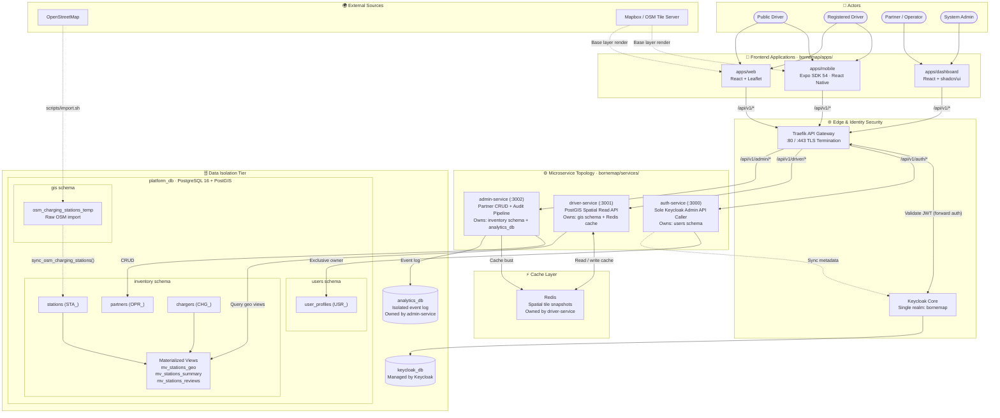

# BorneMap — System Architecture
**Version:** 1.1
**Date:** June 2026
**Status:** Frozen for validation phase

---

## System Diagram



---

## Service Responsibilities (Canonical)

### auth-service (:3000)
- **Only** service that calls the Keycloak Admin REST API
- Handles: registration, login, token refresh, password change (via Keycloak), profile sync
- Owns: `users` schema in `platform_db`
- Does NOT: serve geo data, manage stations, write to `inventory`

### driver-service (:3001)
- Serves all driver-facing spatial queries
- PostGIS queries always include `WHERE s.is_test = FALSE`
- Owns: `gis` schema (raw OSM import), Redis cache
- Reads: `inventory.mv_stations_geo`, `inventory.mv_stations_summary`, `inventory.mv_stations_reviews` via materialized view queries (read-only cross-schema access permitted for materialized views via dedicated read user — no writes)
- Does NOT: call Keycloak, write to `inventory`, manage partners

### admin-service (:3002)
- Partner and station CRUD
- Triggers Redis cache bust after any inventory mutation
- Writes raw audit events to `analytics_db`
- Owns: `inventory` schema, `analytics_db`
- Does NOT: call Keycloak, serve geo queries to end users

---

## Data Flow: OSM Import Pipeline

```
OpenStreetMap Overpass API (Tunisia bounding box)
    ↓ scripts/import.sh
gis.osm_charging_stations_temp  (raw staging)
    ↓ sync_osm_charging_stations() (Postgres function)
inventory.stations               (canonical records)
    ↓ REFRESH MATERIALIZED VIEW CONCURRENTLY
inventory.mv_stations_geo        (geo-optimized read view)
    ↓ REFRESH MATERIALIZED VIEW CONCURRENTLY
inventory.mv_stations_summary    (aggregated display data)
    ↓ REFRESH MATERIALIZED VIEW CONCURRENTLY
inventory.mv_stations_reviews    (review statistics)
```

---

## Cross-Service Communication Rules

- All service-to-service calls use HTTP over internal Docker network
- Internal calls require a service-level auth token (not a user JWT)
- No service may import Rust code from another service's crate
- No service may write directly to another service's schema
- driver-service may query materialized views (read-only) via a dedicated DB read role

---

## Traefik Routing Table

| Path Prefix | Target Service | Auth |
|---|---|---|
| `/api/v1/auth/*` | auth-service:3000 | Public (auth endpoints handle their own) |
| `/api/v1/driver/*` | driver-service:3001 | Public for browse; JWT required for personalized |
| `/api/v1/admin/*` | admin-service:3002 | JWT required, role:partner or role:admin |

---

## Keycloak Configuration

| Item | Value |
|---|---|
| Realm | `bornemap` |
| Clients | `mobile-driver`, `web-driver`, `admin-dashboard` |
| Roles | `role:driver`, `role:partner`, `role:admin` |
| JWT validation | Traefik forward auth + per-service middleware |
| Token storage | Never persisted in `platform_db` |
| Admin API access | auth-service only |
