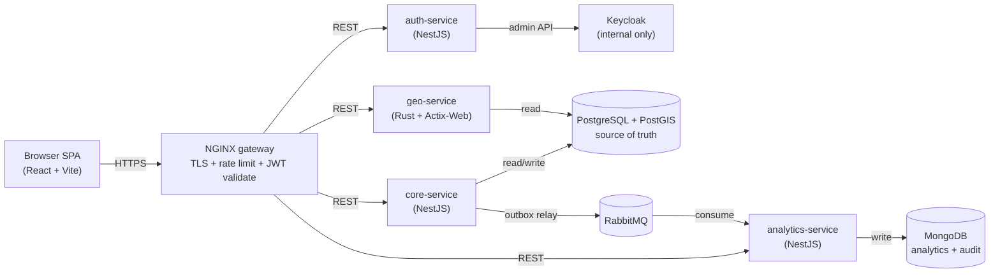
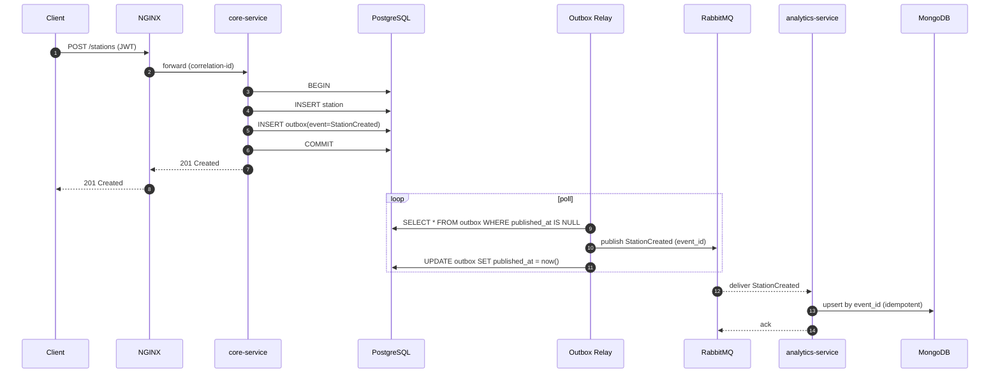
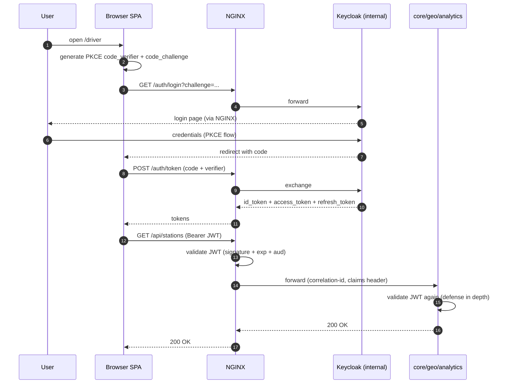

# BorneMap Architecture Overview

This document is a single-page tour of how BorneMap is put together. It
expands the binding rules from the
[Constitution](../../.specify/memory/constitution.md) with concrete
diagrams and call-flows. If anything here conflicts with the constitution,
the constitution wins.

## Service map

Four backend services sit behind a single NGINX gateway. PostgreSQL +
PostGIS is the system of record. MongoDB is reserved for analytics and
audit logs. RabbitMQ carries domain events. Keycloak is the sole identity
provider and is never publicly exposed.

**Enforced rules (Principle I)**:

- Only `core-service` writes to PostgreSQL transactional tables.
- Only `geo-service` reads PostGIS spatial indexes for nearby / bbox /
  route queries.
- Only `analytics-service` reads/writes MongoDB.
- Cross-service database access is forbidden — communication is REST
  (sync) or RabbitMQ (async).
- Keycloak has **no public route** at NGINX; only `auth-service` reaches
  it.

## Outbox event flow (Principle III, NON-NEGOTIABLE)

Every domain event MUST be written to the `outbox` table in the **same
transaction** as its business mutation. A relay worker then publishes
those rows to RabbitMQ. Consumers are at-least-once and MUST be
idempotent on event id.

**Invariants**

- If the business transaction rolls back, the outbox row never exists →
  no phantom event is ever published.
- If the relay fails after publish but before `UPDATE published_at`, the
  event is re-published; the consumer dedupes by `event_id`.
- No service publishes to RabbitMQ outside the outbox pipeline.
- The relay worker lives **with** `core-service` (same deploy unit) so
  network partitions cannot orphan it from its outbox table.

## Authentication flow (Principle V)

OAuth 2.0 Authorization Code with PKCE. Keycloak issues JWTs. The
gateway and every service validate independently. The browser never
talks to Keycloak directly through a public hostname — Keycloak is on
the internal Docker network and only `auth-service` proxies its admin
operations.

**Enforced rules**

- PKCE is mandatory for all interactive clients.
- JWT is validated at NGINX **and** in every service.
- Keycloak is not exposed publicly; it has no NGINX route reachable from
  outside the Docker network except `/auth/*` which `auth-service`
  proxies.
- Secrets (client secrets, signing keys) live in environment variables;
  none committed to the repo.
- Rate limiting is applied at NGINX on all public endpoints.

## Soft-delete semantics (Principle IV)

Soft delete applies **only** to infrastructure entities: `companies`,
`stations`, `chargers`. Each row carries `deleted_at TIMESTAMPTZ`.

- All read queries on these tables MUST include `WHERE deleted_at IS NULL`
  unless the caller is an explicit admin/audit path that opts in.
- Cascade is **soft**: deleting a company soft-deletes its stations and
  their chargers in the same transaction (and writes one outbox event per
  level, so the audit log is complete).
- Non-infrastructure tables (`favorites`, `reviews`, `moderation`,
  `outbox`, audit collections) MUST NOT carry `deleted_at`. They use
  hard delete or their own retention policy.

## Identifier scheme (Principle II)

All infrastructure entities use a **typed-prefix + nanoid** id:

- Company → `CMP-<nanoid>` (e.g., `CMP-a8K3pQ`)
- Station → `STA-<nanoid>`
- Charger → `CHR-<nanoid>`

This is enforced at the schema layer (CHECK constraint on the id column)
and validated at the API boundary. The id is the public identifier;
internal numeric primary keys, if any, MUST NOT leak through the API.

## Observability (Principle VI)

Every service:

- Emits structured JSON logs to stdout.
- Propagates a `X-Correlation-Id` header on every inbound request and
  every outbound REST call or RabbitMQ publish.
- Exposes `/health` (liveness + readiness signaling).
- Exposes `/metrics` in Prometheus text format.

Logs MUST NOT contain raw JWTs, client secrets, or PII beyond what is
strictly needed for support.

## Where things live

- Source of truth: `services/{auth,core,geo,analytics}-service/` and
  `frontend/` (top-level layout fixed by Constitution).
- Infra config: `infra/` (NGINX config, Keycloak realm export, DB init).
- Deployment topology: see [operations/deployment.md](../operations/deployment.md).
- Decisions: see [adr/README.md](../adr/README.md).
