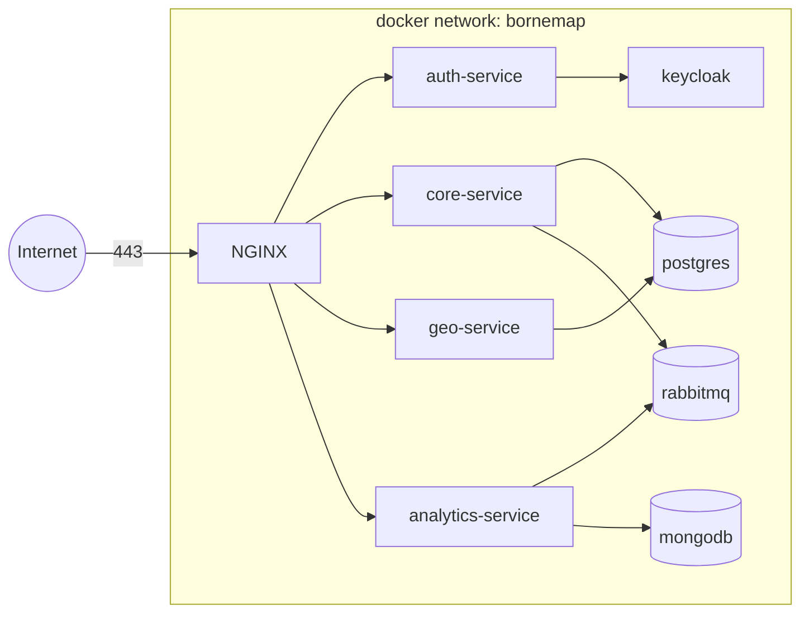

# BorneMap Deployment

Operational topology for BorneMap. This document is binding for production
and for local Docker Compose dev. If it conflicts with the
[Constitution](../../.specify/memory/constitution.md), the constitution
wins.

## Topology

On-premises, single-node, orchestrated by `docker-compose.yml`. NGINX is
the only container with a public port. Everything else is on the internal
Docker network.



## Required containers

| Container         | Purpose                                  | Public? |
|-------------------|------------------------------------------|---------|
| `nginx`           | TLS termination, rate limit, JWT validate, routing | Yes (443) |
| `keycloak`        | Identity provider                        | No |
| `auth-service`    | Keycloak proxy, login/token/refresh      | No (via nginx) |
| `core-service`    | Business APIs + outbox relay             | No (via nginx) |
| `geo-service`     | Geospatial APIs (Rust)                   | No (via nginx) |
| `analytics-service` | Outbox consumer + read APIs            | No (via nginx) |
| `postgres`        | PostgreSQL + PostGIS, source of truth    | No |
| `mongodb`         | Analytics + audit logs                   | No |
| `rabbitmq`        | Event bus                                | No |

Any deviation from this list requires an ADR.

## NGINX routing

The gateway terminates TLS and routes by path prefix. JWT validation runs
at the gateway for `/api/*` and `/auth/refresh`. The SPA is served by
NGINX from a static bundle.

| Path                  | Routed to             | Auth at gateway |
|-----------------------|-----------------------|-----------------|
| `/` (and SPA assets)  | static (SPA build)    | none |
| `/auth/login`         | `auth-service`        | none |
| `/auth/callback`      | `auth-service`        | none |
| `/auth/token`         | `auth-service`        | none |
| `/auth/refresh`       | `auth-service`        | JWT required |
| `/api/companies/*`    | `core-service`        | JWT required (admin) |
| `/api/stations/*`     | `core-service`        | JWT required where mutating |
| `/api/chargers/*`     | `core-service`        | JWT required where mutating |
| `/api/favorites/*`    | `core-service`        | JWT required |
| `/api/reviews/*`      | `core-service`        | JWT required for write |
| `/api/moderation/*`   | `core-service`        | JWT required (admin / operator) |
| `/api/geo/*`          | `geo-service`         | none for public reads |
| `/api/analytics/*`    | `analytics-service`   | JWT required (admin) |
| `/api/audit/*`        | `analytics-service`   | JWT required (admin) |
| `/health` (per host)  | per-service `/health` | none |
| `/metrics`            | **not exposed publicly**; scraped on internal network only | n/a |

Rules:

- Keycloak has **no public route**. `/auth/*` is served by
  `auth-service`, which talks to Keycloak internally.
- `/metrics` MUST NOT be exposed publicly. Prometheus scrapes on the
  internal Docker network only.
- Rate limiting MUST be configured at NGINX on all `/api/*` and `/auth/*`
  routes.

## TLS

- TLS terminates at NGINX.
- Certificates issued by **Let's Encrypt** via the standard ACME flow.
- Auto-renewal is mandatory (cron or sidecar; the choice is an
  infra-level decision recorded in `infra/nginx/`).
- HSTS MUST be enabled with `max-age` ≥ 6 months on the production host.
- Target SSL Labs grade ≥ A (verified in Phase 11).

## Environment variables

Secrets and environment-specific values are supplied **exclusively** via
environment variables. No secret value MUST be committed to the
repository.

- `.env.example` lists every required variable with placeholder values.
- `.env` files are git-ignored.
- Production secrets are managed outside the repository (host-level
  secret store or compose `--env-file`).

Required variable categories per service:

| Category | Examples |
|---|---|
| Database | `POSTGRES_URL`, `MONGO_URL` |
| Queue | `RABBITMQ_URL` |
| Identity | `KEYCLOAK_ISSUER_URL`, `KEYCLOAK_JWKS_URL`, `OAUTH_CLIENT_ID`, `OAUTH_CLIENT_SECRET` |
| Public URL | `PUBLIC_BASE_URL` |
| Observability | `LOG_LEVEL`, `SERVICE_NAME` |
| Geo | `TUNISIA_OSM_DATA_PATH` (build-time / volume) |

## `/health` contract

Every service exposes `GET /health` returning JSON:

```json
{
  "status": "ok",
  "service": "core-service",
  "version": "1.2.3",
  "checks": {
    "db": "ok",
    "queue": "ok"
  },
  "uptime_seconds": 12345
}
```

- HTTP 200 only if all critical dependencies report `ok`.
- HTTP 503 if any critical dependency fails.
- Used by Docker / orchestrator for liveness AND readiness.

## `/metrics` contract

Every service exposes `GET /metrics` in Prometheus text format. At
minimum:

- HTTP request count, latency histogram, error rate by route and status.
- For `core-service`: outbox queue depth, relay publish latency, relay
  failure count.
- For `analytics-service`: consumer lag, idempotent-skip count.
- For `geo-service`: query latency histogram per endpoint (nearby, bbox,
  route, ETA), cache hit ratio.

`/metrics` MUST NOT be reachable from the public internet (see routing
table above).

## Logging

- Structured JSON to stdout.
- Every log line carries `correlation_id`, `service`, `timestamp`,
  `level`, `message`.
- No raw JWTs, no client secrets, no PII beyond what is strictly required
  for support.

## Backups (Phase 11)

- PostgreSQL: nightly `pg_dump` of all databases; weekly base backup +
  WAL archiving in production.
- MongoDB: nightly `mongodump`.
- Retention: 7 daily + 4 weekly + 6 monthly (target; tune to disk).
- Backups stored off-host. Restore procedure documented and rehearsed
  before production cutover.

## Runbook references

- Local up: `make up`
- Local down: `make down`
- Tail logs: `make logs`
- Run tests: `make test`
- Bundle OpenAPI: `make openapi`

The `Makefile` is delivered in Phase 1; commands above are the contract
that file MUST implement.
