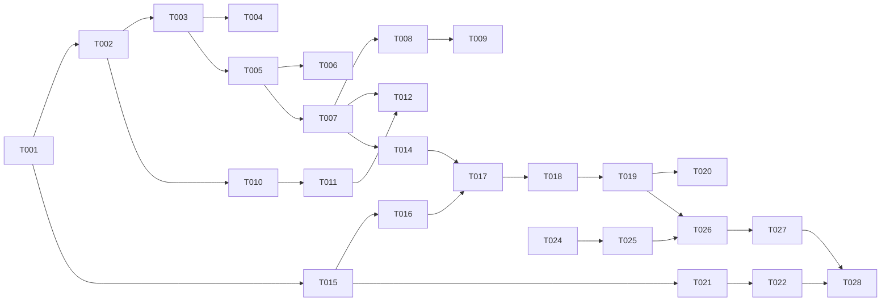

# Tasks: Sprint 001 — End-to-End Spatial Flow

**Input**: `execution/sprints/sprint-001/spec/sprint_spec.md`, `execution/sprints/sprint-001/backlog/plan.md`

**Format**: `[ID] [P] [Epic] [Story] Description`

---

## Phase 1: Infrastructure & Schema (EPIC-001)

**Purpose**: PostgreSQL 16 + PostGIS running, full inventory schema deployed.

**⛔ BLOCKS**: All subsequent phases

### US1: PostGIS Running

- [ ] T001 [P] [EPIC-001] [US1] Create docker-compose.yml with PostgreSQL 16 + PostGIS in `platform/infrastructure/docker/docker-compose.yml`
- [ ] T002 [P] [EPIC-001] [US1] Create init SQL: `CREATE EXTENSION IF NOT EXISTS postgis; hstore; pgcrypto` in `platform/infrastructure/postgres/init/01-extensions.sql`

### US2: Lookup Tables Seeded

- [ ] T003 [P] [EPIC-001] [US2] Create migration: access_types, data_sources, connector_types, current_types, connector_statuses, station_statuses, charger_statuses in `platform/infrastructure/postgres/migrations/02-lookup-tables.sql`
- [ ] T004 [P] [EPIC-001] [US2] Seed lookup tables (osm, manual, partner sources; active/inactive statuses; AC/DC current types; Type2/CCS/CHAdeMO connector types) in `platform/infrastructure/postgres/seeds/03-lookup-seeds.sql`

### US3: Entity Tables Created

- [ ] T005 [P] [EPIC-001] [US3] Create partners table (`PAR-` nanoid PK, name, type, support contact, soft-delete, audit) in `platform/infrastructure/postgres/migrations/04-partners.sql`
- [ ] T006 [P] [EPIC-001] [US3] Create partner_users join table in `platform/infrastructure/postgres/migrations/04-partners.sql`
- [ ] T007 [EPIC-001] [US3] Create stations table (`STA-` nanoid PK, `location GEOGRAPHY(Point,4326)`, tags HSTORE, is_test, soft-delete, version, FK→partners) in `platform/infrastructure/postgres/migrations/05-stations.sql`
- [ ] T008 [EPIC-001] [US3] Create chargers table (`CHR-` nanoid PK, serial, vendor/model/firmware, FK→stations, soft-delete) in `platform/infrastructure/postgres/migrations/06-chargers.sql`
- [ ] T009 [EPIC-001] [US3] Create connectors table (`CON-` nanoid PK, power/voltage/amperage specs, availability counts, FK→chargers, UNIQUE(charger,type,current), soft-delete) in `platform/infrastructure/postgres/migrations/07-connectors.sql`
- [ ] T010 [P] [EPIC-001] [US3] Create gis.osm_charging_stations_temp staging table (osm_id, raw_tags HSTORE, lat, lng, fetched_at) in `platform/infrastructure/postgres/migrations/08-osm-staging.sql`

**Checkpoint**: `docker compose up` → `SELECT PostGIS_version()` → all 15 tables exist in `inventory` schema

---

## Phase 2: OSM Data Pipeline (EPIC-002)

**Purpose**: Raw OSM Tunisia data ingested and normalized.

### US4: OSM Import to Staging

- [ ] T011 [EPIC-002] [US4] Create import.sh: Overpass API query (`node[amenity=charging_station]`, Tunisia bbox 7°–12°E, 30°–38°N), parse JSON, INSERT into gis.osm_charging_stations_temp with `ON CONFLICT (osm_id) DO NOTHING` in `platform/scripts/import.sh`

### US5: Normalization to Stations

- [ ] T012 [EPIC-002] [US5] Create sync_osm_charging_stations() PL/pgSQL function: generate `STA-`||nanoid(12), extract name/geometry/tags from staging, set source='osm', is_test=FALSE in `platform/infrastructure/postgres/functions/10-sync-osm-stations.sql`
- [ ] T013 [EPIC-002] [US5] Run import + sync, verify stations populated with valid STA-nanoid IDs and GEOGRAPHY(Point,4326) geometries

**Checkpoint**: `SELECT COUNT(*) FROM inventory.stations WHERE source = 'osm'` returns > 0

---

## Phase 3: Spatial Query & API (EPIC-003)

**Purpose**: PostGIS function + REST API.

### US6: Spatial Query Function

- [ ] T014 [EPIC-003] [US6] Create find_nearby_stations(lat, lng, radius_meters) PL/pgSQL function: ST_DWithin GEOGRAPHY, WHERE is_test=FALSE AND is_deleted=FALSE, ORDER BY ST_Distance, RETURN TABLE(station_id, name, distance_meters) in `platform/infrastructure/postgres/functions/11-find-nearby-stations.sql`

### US7: REST API

- [ ] T015 [P] [EPIC-003] [US7] Initialize driver-service Rust crate: Actix-web, SQLx, serde, tokio, tracing in `source/services/driver-service/Cargo.toml`
- [ ] T016 [P] [EPIC-003] [US7] Create domain layer: Station struct, NearbyQuery value object (lat/lng/radius with bounds validation), NearbyResult in `source/services/driver-service/domain/`
- [ ] T017 [EPIC-003] [US7] Create infrastructure DB adapter: SQLx query call to find_nearby_stations(), map rows to domain model in `source/services/driver-service/infrastructure/`
- [ ] T018 [EPIC-003] [US7] Create application use-case: NearbyStationsService orchestrating DB call + response mapping in `source/services/driver-service/application/`
- [ ] T019 [EPIC-003] [US7] Create API handler: GET /api/v1/driver/nearby?lat&lng&radius, param validation (lat ±90, lng ±180, radius > 0), JSON response in `source/services/driver-service/api/`
- [ ] T020 [P] [EPIC-003] [US7] Create OpenAPI spec for nearby endpoint in `sprints/sprint-001/api/openapi.yaml`

**Checkpoint**: `curl localhost:3001/api/v1/driver/nearby?lat=34&lng=9.5&radius=50000` returns station JSON

---

## Phase 4: Health & Map UI (EPIC-004)

**Purpose**: Service health check + driver-facing map.

### US8: Health Endpoint

- [ ] T021 [P] [EPIC-004] [US8] Create API handler: GET /api/v1/driver/health, check DB connectivity (SELECT 1), return JSON status in `source/services/driver-service/api/health.rs`
- [ ] T022 [P] [EPIC-004] [US8] Create Traefik dynamic config: route /api/v1/driver/* → driver-service:3001 in `platform/infrastructure/traefik/dynamic.yml`

### US9: Map UI

- [ ] T023 [P] [EPIC-004] [US9] Initialize web app: React 18, Tailwind CSS, Leaflet, react-leaflet, vite in `source/apps/web/`
- [ ] T024 [EPIC-004] [US9] Create MapView component: Leaflet map centered on Tunisia (34.0, 9.5), zoom 7, OpenStreetMap tiles in `source/apps/web/src/components/MapView.tsx`
- [ ] T025 [EPIC-004] [US9] Create useNearbyStations hook: fetch GET /api/v1/driver/nearby, return data/loading/error state in `source/apps/web/src/hooks/useNearbyStations.ts`
- [ ] T026 [EPIC-004] [US9] Create Home page: integrate MapView + useNearbyStations, render markers for each station, handle loading spinner, error with retry, empty state message in `source/apps/web/src/pages/Home.tsx`
- [ ] T027 [EPIC-004] [US9] Create App entry point: React Router, page layout, mount Home in `source/apps/web/src/App.tsx`

**Checkpoint**: Full stack — Docker → Traefik → driver-service → DB → API → Leaflet map with station markers

---

## Phase 5: Verification

**Purpose**: End-to-end validation.

- [ ] T028 [ALL] Run full stack, verify all success criteria: DB loaded, API responds, map shows stations, health returns OK
- [ ] T029 [ALL] Update docs/SYSTEM_STATE.md with sprint-001 state
- [ ] T030 [ALL] Create execution/sprints/sprint-001/review/sprint_review.md

---

## Dependencies

## Key

- `[P]` = parallelizable (no file conflicts)
- `[EPIC-XXX]` = epic grouping
- `[USX]` = user story mapping
