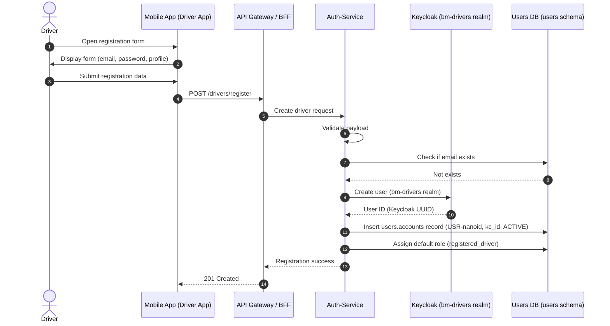

# Feature Specification: Identity Core

**Feature Branch**: `001-identity-core`

**Created**: 2026-06-15

**Status**: Clarified

**Input**: User description: "MVP-2 Identity Core with Keycloak — identity ownership rules, authentication, authorization, shared identity library, user synchronization"

## Clarifications

### Session 2026-06-15

- Q: What happens when Keycloak is unavailable during login/registration? → A: Degraded mode — existing sessions continue (local JWT validation). New login and registration return a clear "service temporarily unavailable" error.
- Q: What are the valid account statuses and transitions? → A: For MVP-2: ACTIVE (post-registration, immediately operational) and DISABLED (admin-deactivated). Email verification (PENDING_VERIFICATION status) deferred to post-MVP-2. Transitions: ACTIVE → DISABLED (admin action), DISABLED → ACTIVE (admin re-enable).
- Q: What observability signals should auth-service emit? → A: Standard — structured JSON logging (with level, event type, request_id), a `/health` endpoint for container orchestration, and identity-event counters (registrations, logins, failures, role changes). Audit_log table handles compliance.
- Q: How should brute-force login attempts be mitigated? → A: Two-tier rate limiting — 10 failed login attempts per minute per IP address, plus account cooldown after 20 failed attempts within 15 minutes on the same account. Audit events recorded for both tiers.

## User Scenarios & Testing *(mandatory)*

### User Story 1 - Driver Registration and Login (Priority: P1)

A new driver wants to create an account and access the map to find charging stations. They register with their email, set a password, and can immediately log in to see nearby stations.

**Why this priority**: Registration and login are the foundation for all other identity features. Without it, no user can access the platform.

**Independent Test**: Can be fully tested by opening the registration page, creating a new account with email/password, logging out, and logging back in with the same credentials.

**Acceptance Scenarios**:

1. **Given** a new visitor on the registration page, **When** they enter a valid email and password and submit, **Then** they receive a confirmation and can log in immediately
2. **Given** a registered user on the login page, **When** they enter their correct email and password, **Then** they receive a valid session
3. **Given** a registered user, **When** they enter an incorrect password, **Then** they see a clear error message and access is denied
4. **Given** a registration attempt with an already-registered email, **When** the user submits, **Then** they see a message that the email is already in use

---

### User Story 2 - Authenticated Station Discovery (Priority: P1)

A registered driver wants to see nearby charging stations. They log in, their identity is verified, and the driver service returns stations within their search area.

**Why this priority**: This is the core platform value — authenticated access to geospatial station data. It validates that identity integrates correctly with the existing driver-service.

**Independent Test**: Can be fully tested by logging in as a registered driver, making a nearby stations query, and verifying the response includes stations.

**Acceptance Scenarios**:

1. **Given** an authenticated driver, **When** they request nearby stations with valid coordinates, **Then** they receive a list of stations
2. **Given** an unauthenticated request, **When** someone tries to access the stations API, **Then** the request is rejected with an authentication error
3. **Given** an expired or revoked session, **When** a user presents the expired token, **Then** access is denied

---

### User Story 3 - Partner Account Management (Priority: P2)

A partner organization needs to manage their charging stations. An admin creates a partner account, and the partner can log in to access station management features.

**Why this priority**: Partners are the second user type after drivers. Their identity needs to be separate from drivers with different roles and permissions.

**Independent Test**: Can be tested by an admin creating a partner account, then the partner logging in and receiving appropriate role-based access.

**Acceptance Scenarios**:

1. **Given** an admin user, **When** they create a partner account, **Then** the partner receives a platform user ID
2. **Given** a partner user, **When** they log in, **Then** they receive appropriate role claims indicating partner-level access

---

### User Story 4 - Session Management and Security (Priority: P1)

A logged-in user wants to securely end their session. They log out, and their token becomes invalid immediately.

**Why this priority**: Session security is a baseline requirement. Users must be able to control their active sessions.

**Independent Test**: Can be tested by logging in, making an authenticated request to verify access, logging out, and then verifying the same token is rejected.

**Acceptance Scenarios**:

1. **Given** an authenticated user, **When** they log out, **Then** their current session token is invalidated
2. **Given** a user with an expiring session, **When** they use the refresh mechanism, **Then** they receive a new valid token without re-entering credentials
3. **Given** an expired refresh token, **When** the user attempts to refresh, **Then** they are prompted to log in again

---

### Edge Cases

- What happens when the identity provider is unreachable during registration? → Existing sessions continue via locally cached JWKS. New login and registration return "service temporarily unavailable".
- How does the system handle a user trying to register with an email that was previously used by a deactivated account? → Re-activates the DISABLED account (see research.md)
- What happens when a user's realm changes (e.g., driver promoted to partner)? → Out of scope for MVP-2 (see research.md)
- How does the system handle concurrent login attempts with the same credentials? → Rate limiting at both IP and account level (see research.md)
- DISABLED accounts: token presented after account is disabled → access denied even if token is not expired. Audit event recorded.

## Requirements *(mandatory)*

### Functional Requirements

- **FR-001**: System MUST allow new users to register with email and password
- **FR-002**: System MUST issue a secure session token upon successful authentication
- **FR-003**: System MUST support token refresh without requiring re-authentication
- **FR-004**: System MUST invalidate sessions upon explicit logout
- **FR-005**: System MUST provide a way to resolve the current authenticated user's identity and role
- **FR-006**: System MUST support two identity realms: one for drivers and one for platform control (admin/partner)
- **FR-007**: System MUST assign appropriate roles based on the user's realm and account type
- **FR-008**: System MUST generate a unique human-readable platform identifier (USR- prefix) for each user at registration
- **FR-009**: System MUST maintain a user registry that maps platform user IDs to authentication identities
- **FR-010**: System MUST enforce unique email addresses across all realms
- **FR-011**: System MUST authenticate users via a standard web browser redirect flow rather than direct credential submission from client applications
- **FR-012**: System MUST validate tokens locally on each service without requiring runtime calls to the identity provider
- **FR-013**: System MUST provide a shared mechanism for services to validate tokens and extract identity claims
- **FR-014**: System MUST synchronize user lifecycle events (creation, update, role change, first login) into the user registry
- **FR-015**: System MUST NOT include business workflows (partner creation, partner approval) in the identity service
- **FR-016**: System MUST store all secrets via environment variables or secret management — no hardcoded credentials allowed
- **FR-017**: System MUST support user profile fields: first name, last name, username, email, role, and active status
- **FR-018**: A default platform admin user MUST be created during initial deployment, with the admin role in the platform control realm, to enable first-time access
- **FR-019**: The seed admin's credentials MUST be configurable via environment variable — never hardcoded in source code or configuration files
- **FR-020**: Accounts MUST support two statuses for MVP-2: ACTIVE (post-registration, immediately operational) and DISABLED (admin-deactivated). Status transitions are: ACTIVE↔DISABLED via admin action. Email verification (PENDING_VERIFICATION status) is deferred to post-MVP-2
- **FR-021**: The identity service MUST expose a health check endpoint for container orchestration
- **FR-022**: The identity service MUST emit structured JSON logs (including event type, severity level, and request correlation ID) for all identity lifecycle events
- **FR-023**: The identity service MUST track and expose counters for key identity events: registrations, successful logins, failed login attempts, role changes, and account status changes

### Key Entities *(include if feature involves data)*

- **Account**: A person or entity with platform access. Has a platform identifier (USR- prefix), authentication identity mapping (keycloak_user_id), email, name, realm membership, and status (ACTIVE, DISABLED). Stored in a dedicated identity schema. Email verification (PENDING_VERIFICATION) and MFA deferred to post-MVP-2
- **Identity Realm**: A logical grouping of users with shared authentication policies. Two realms exist: drivers (`bm-drivers`) and platform control (`bm-control`)
- **Platform User Registry**: The `users.accounts` table as the master identity ledger. Cross-service foreign key target for all user references
- **Authentication Identity**: The external identity reference (Keycloak UUID) linked to a platform account ID. Immutable once established
- **Role**: A named set of permissions (admin, partner, registered_driver). Stored as system roles with many-to-many assignment to accounts
- **Identity Provider**: A federation source (LOCAL, GOOGLE, APPLE, etc.) linked to an account for external authentication
- **Session**: An authenticated user interaction period, bounded by token expiration and explicit logout
- **Audit Event**: A recorded identity lifecycle event (registration, login, role change, account status change) for compliance and debugging

## Success Criteria *(mandatory)*

### Measurable Outcomes

- **SC-001**: A new user can complete registration and be authenticated in under 30 seconds
- **SC-002**: An authenticated user can access the station discovery API within 2 seconds of login
- **SC-003**: Token validation for API requests completes in under 50 milliseconds (no round-trip to identity provider)
- **SC-004**: An administrator can create a partner account and the partner can log in within 1 minute
- **SC-005**: The identity service handles 100 concurrent registration requests without errors
- **SC-006**: Sessions are reliably invalidated within 5 seconds of logout
- **SC-007**: No identity provider credentials or secrets appear in source code or configuration files

## Assumptions

- Users have a valid email address and access to it for account recovery
- The identity provider is deployed on the same network as the platform services
- The existing driver-service will consume the shared identity library for token validation — its API endpoints remain unchanged
- Mobile and web clients will implement the browser redirect flow; the identity service only provides the token exchange endpoints
- Partner accounts require an existing admin user to create them via the identity API
- The MVP-1 mock-identity fallback (`usr-mvp1-fallback`) will be phased out as real authenticated users are created
- Keycloak realms, clients, and roles will be configured via CLI tooling rather than the admin console
