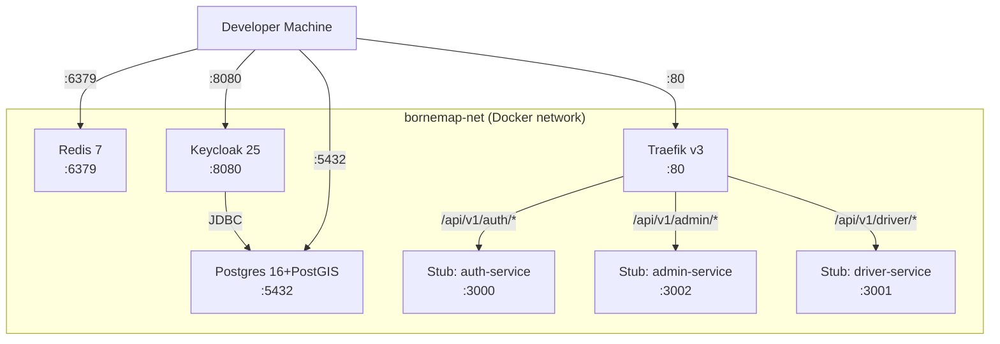

# Infrastructure Topology Model

**Phase 1 output** — Entities, relationships, and configuration for Sprint 0.

## Service Topology



## Postgres Databases

| Database | Purpose | Connection | 
|----------|---------|-----------|
| `platform_db` | Main application DB (gis, inventory, users schemas) | `postgresql://{role}@localhost:5432/platform_db` |
| `keycloak_db` | Keycloak internal state | Managed by Keycloak via JDBC |
| `analytics_db` | Audit logging (Admin Service writes) | `postgresql://admin_analytics_role@localhost:5432/analytics_db` |

## Platform DB Schemas

| Schema | Owner | Content | Accessed By |
|--------|-------|---------|-------------|
| `gis` | `admin_service_role` | Spatial reference data, OSM imports | admin_service_role |
| `inventory` | `admin_service_role` | partners, stations, chargers, materialized views | admin_service_role (write), driver_service_role (read) |
| `users` | `auth_service_role` | User profiles (USR- rows) | auth_service_role only |

## Database Roles

| Role | Can Access | Cannot Access |
|------|-----------|--------------|
| `auth_service_role` | `users` schema | `gis`, `inventory` |
| `admin_service_role` | `gis`, `inventory` | `users` |
| `driver_service_role` | `inventory` (read-only) | `gis`, `users` |
| `admin_analytics_role` | `analytics_db.audit_log` | `platform_db` |

## Keycloak Realm Configuration

| Item | Value |
|------|-------|
| Realm name | `bornemap` |
| Clients | `mobile-driver-app`, `web-driver-app`, `admin-dashboard` |
| Roles | `role:driver`, `role:partner`, `role:admin` |
| Auth flow | Password grant + refresh token |
| JWKS endpoint | `/realms/bornemap/protocol/openid-connect/certs` |

## Traefik Routing

| Path Prefix | Backend Service | Container Port |
|-------------|----------------|---------------|
| `/api/v1/auth/` | auth-service | 3000 |
| `/api/v1/admin/` | admin-service | 3002 |
| `/api/v1/driver/` | driver-service | 3001 |
| All others | 404 response | — |

## Docker Volumes

| Volume | Mount | Used By |
|--------|-------|---------|
| `pgdata` | `/var/lib/postgresql/data` | Postgres |
| `keycloak_data` | `/opt/keycloak/data` | Keycloak |
| `redis_data` | `/data` | Redis |

## Initial Tables (inventory schema)

```sql
CREATE TABLE inventory.partners (
    id TEXT PRIMARY KEY CHECK (id ~ '^OPR-.+'),
    name TEXT NOT NULL,
    email TEXT UNIQUE NOT NULL,
    phone TEXT,
    is_active BOOLEAN NOT NULL DEFAULT true,
    created_at TIMESTAMPTZ NOT NULL DEFAULT now(),
    updated_at TIMESTAMPTZ NOT NULL DEFAULT now()
);

CREATE TABLE inventory.stations (
    id TEXT PRIMARY KEY CHECK (id ~ '^STA-.+'),
    partner_id TEXT NOT NULL REFERENCES inventory.partners(id),
    name TEXT NOT NULL,
    location GEOGRAPHY(POINT, 4326) NOT NULL,
    address TEXT,
    is_active BOOLEAN NOT NULL DEFAULT true,
    created_at TIMESTAMPTZ NOT NULL DEFAULT now(),
    updated_at TIMESTAMPTZ NOT NULL DEFAULT now()
);

CREATE TABLE inventory.chargers (
    id TEXT PRIMARY KEY CHECK (id ~ '^CHG-.+'),
    station_id TEXT NOT NULL REFERENCES inventory.stations(id),
    connector_type TEXT NOT NULL,
    power_kw NUMERIC(5,1) NOT NULL,
    status TEXT NOT NULL DEFAULT 'offline',
    is_active BOOLEAN NOT NULL DEFAULT true,
    created_at TIMESTAMPTZ NOT NULL DEFAULT now(),
    updated_at TIMESTAMPTZ NOT NULL DEFAULT now()
);
```
